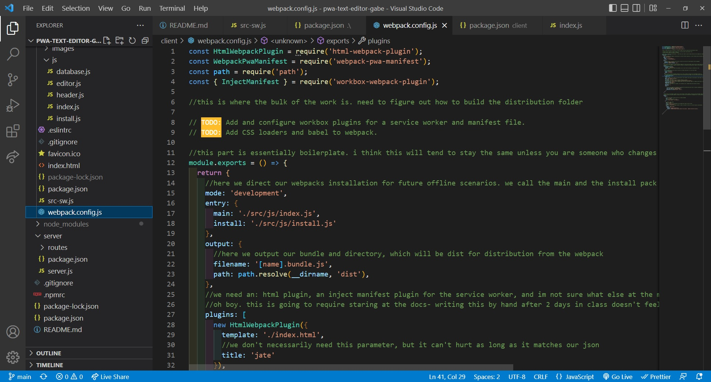
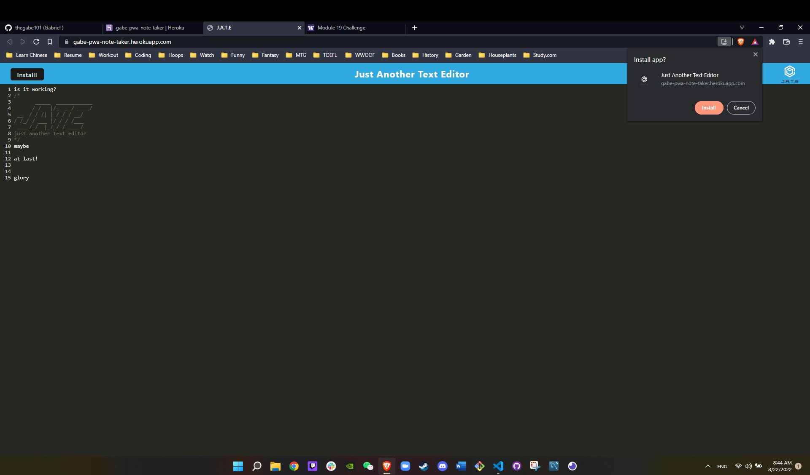
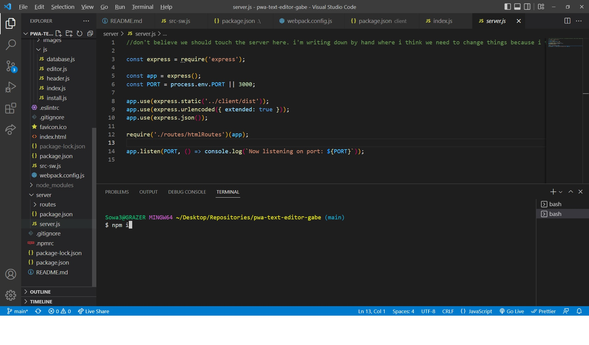
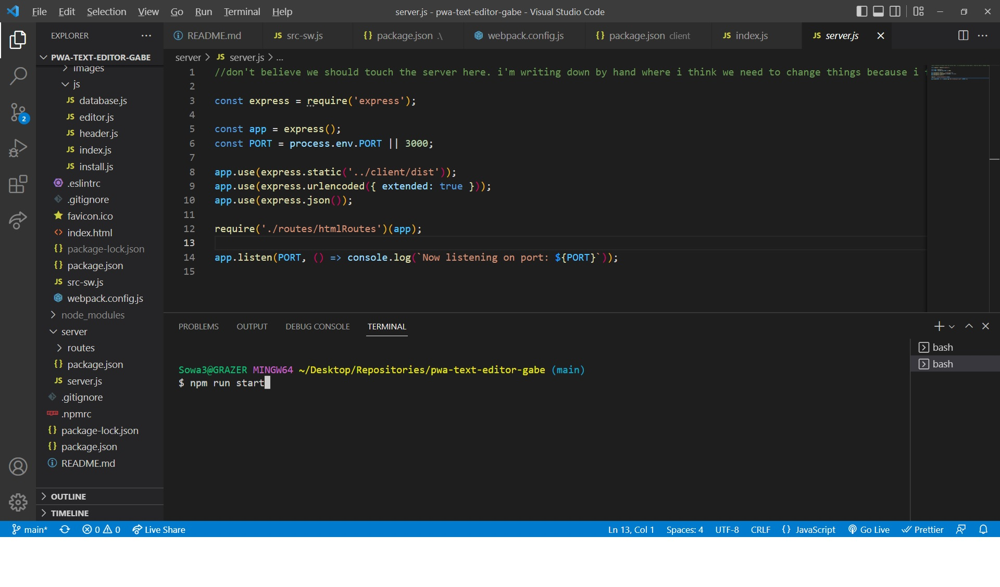
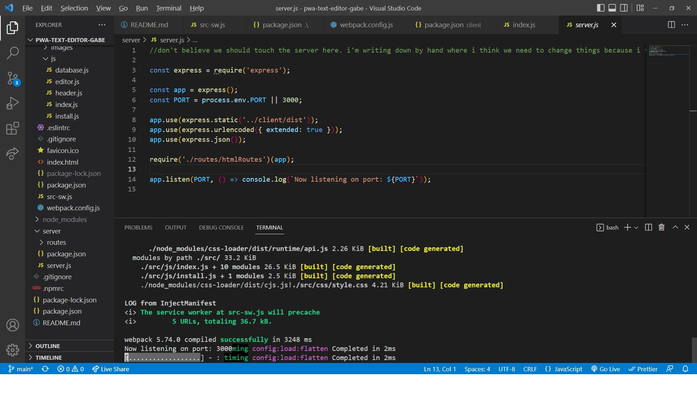
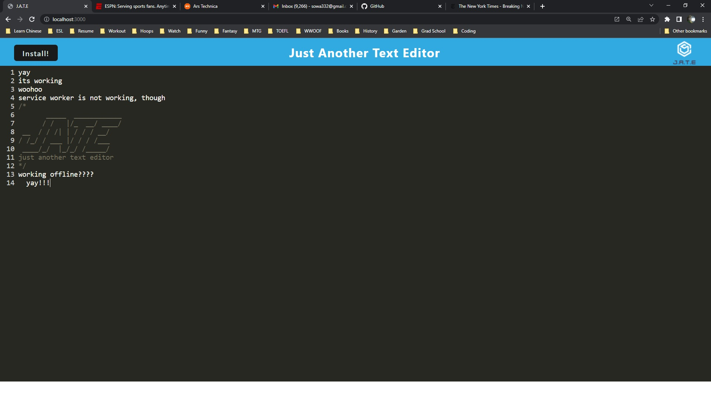
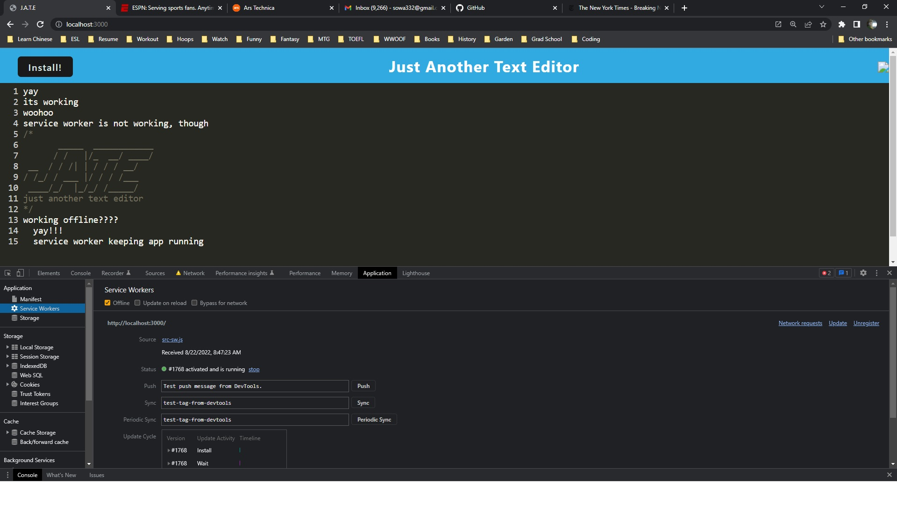

# Text Editor Starter Code

https://whispering-reef-09866.herokuapp.com/

## Table of Contents

- [Description](#description)
- [Screenshots](#screenshots)
- [Credits](#credits)

## Description

This project involved refactoring code to create a Progressive Web App that could run offline. An app needs to fulfill several qualifications to be considered a PWA, all of which this does: it should contain manifest JSON files and a service worker, it should run offline, and it should be highly responsive and fast given it is running locally. Preferably, it will achieve its speed by caching its static assets (such as its images, JS files, etc.) and retrieving them there.

## Screenshots

- 
- 
- 
- 
- 
- 
- 

## Credits

- This project could not have been completed without the hardwork and excellent advice of my educators at UW Fullstack and tutor, Jacob Carver.
